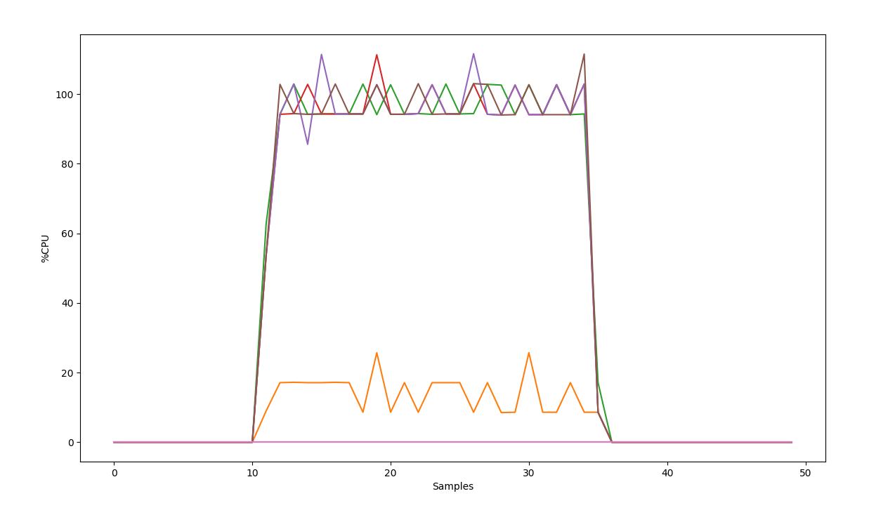

# CPUMonitor

CPUMonitor is a package designed to make it easier to monitor and visualize multiple CPU processes on a single Linux host.

CPU and Memory use are monitored using Linux's `top` command. As per their documentation, the returned CPU values are defined as:
*The task's share of the elapsed CPU time since the last screen update, expressed as a percentage of total CPU time. In a true SMP environment, if 'Irix mode' is Off, top will operate in 'Solaris mode' where a task's cpu usage will be divided by the total number of CPUs. You toggle 'Irix/Solaris' modes with the 'I' interactive command.*

The returned memory values are defined as : *A task's currently used share of available physical memory.*

## Installation
-----

CPUMonitor can be installed using the Julia package manager. If you have a Github account, run the following from the Julia REPL:

    https://github.com/klensink/CPUMonitor.jl.git

Otherwise run:

    git@github.com:klensink/CPUMonitor.jl.git

## Example
-----

The monitor requires it's own process, so start an additional instance of Julia on the same host as the processes you wish to track. SLIM users can do this by SSHing onto the same node as your workers. For example `ssh n038`. This process will be reffered to as the `monitoring process`, and the processes being tracked will be referred to as the `workers`. The following example uses 4 `workers` and 1 `monitoring process`.

The `username` argument will restrict the monitor to processes owned by a certain user. The optional argument `iterations` sets how many samples will be taken, and `delay` sets the approximate sample interval. 

Inorder to have something to monitor, define a function to be evaluated on the `working process`.

    julia> addprocs(4)
    julia> @everywhere busy_work(x) = sum(norm(fft(rand(x)))) 

Start a monitoring session on the machine, using the `monitoring process`.

    julia> stats = monitor("klensink", iterations = 100, delay = 0.05, command = "julia", verbose = true)

Then do some work on the same machine, so there is something to measure on the `working process`.

    julia> pmap(busy_work, Array(10000:15000))

The monitor returns a `CPUStat` object for each process of the machine. Each `CPUStat` contains the process ID, the CPU use data, and the memory use data.

Plot the results to get an idea of how the CPU statistics vary over time.

    julia> using PyPlot

    julia> [plot(stats[i].cpu) for i in 1:length(stats)]

